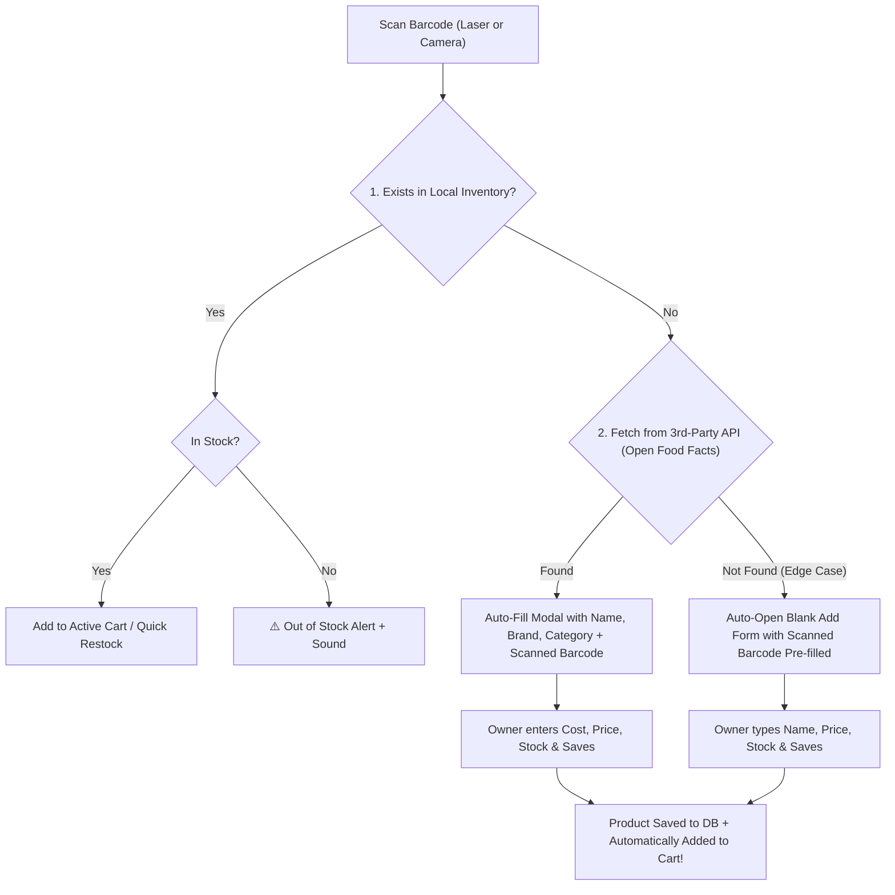

# Dual-Mode Barcode Scanner Plan (Physical + Camera) & 3-Tier Product Resolution

## Context & Objectives
For a **sari-sari store**, inventory consists of:
1. **Barcoded items**: Canned goods, instant noodles, sodas, snacks, toiletries.
2. **Unbarcoded items (Nullable Barcode)**: Loose candies, eggs, repacked sugar/cooking oil, ice water/ice candy, bakery bread.
3. **New Stock Intake (3-Tier Auto-Lookup)**: When a new barcoded product is scanned, auto-fetch details from a 3rd-party product database (e.g., Open Food Facts API). If neither our inventory nor the 3rd party knows it, gracefully fall back to rapid manual creation with pre-filled barcode.

---

## 1. 3-Tier Barcode Resolution & Edge Case Pipeline



### Resolution Flow Details:
1. **Tier 1 (Local Store Inventory)**:
   - Match by `barcode`.
   - Found $\rightarrow$ Add to Cart (POS) or Increment Stock (Restock).
2. **Tier 2 (Third-Party Product Lookup)**:
   - If not found locally, query 3rd-party API (e.g., `https://world.openfoodfacts.org/api/v2/product/{barcode}.json` or GS1).
   - If found $\rightarrow$ Pop open Quick-Add modal with:
     - Name: `Lucky Me Instant Pancit Canton Kalamansi`
     - Category: `Noodles & Pasta`
     - Barcode: `4800016644409` (locked/prefilled)
     - User inputs: Selling Price (`₱18.00`), Cost (`₱15.00`), Stock (`24`).
3. **Tier 3 (Edge Case: Unknown locally AND unknown in 3rd-party service)**:
   - Neither system recognizes the barcode (e.g. local provincial brand or custom repacked barcode).
   - System displays toast: *"New barcode detected (4800016644409) — not found in catalog"*.
   - Automatically opens Add Product form with:
     - Barcode field pre-filled.
     - Auto-focus placed immediately in the **Product Name** input field.
   - **Quick POS Handshake**: When saved, the new product is **instantly added to the current customer's cart**, allowing the cashier to complete the sale without re-scanning or restarting!

---

## 2. Unbarcoded Items Handling (Nullable Barcodes)

- In the database, `barcode` is `NULL` for unbarcoded items (e.g. "Egg (Piece)", "Repacked Cooking Oil 200ml", "Ice Candy").
- **Unique Constraint with Partial Index**:
  ```sql
  -- Allows multiple NULL and empty values, but ensures all non-null barcodes are strictly unique
  CREATE UNIQUE INDEX IF NOT EXISTS idx_products_barcode 
  ON public.products(barcode) 
  WHERE barcode IS NOT NULL AND barcode != '';
  ```
- **POS Manual Selection**: Unbarcoded items remain instantly searchable and selectable via the POS UI product grid and search bar.

---

## 3. Proposed Technical Changes

### Dependencies
- `html5-qrcode` for camera viewfinder.

```bash
npm install html5-qrcode
```

---

### Database Migration

#### [NEW] [20260912040000_add_product_barcode.sql](file:///c:/projects/webdevshiz/auj-store/supabase/migrations/20260912040000_add_product_barcode.sql)
```sql
-- Add nullable barcode column to products
ALTER TABLE "public"."products"
  ADD COLUMN IF NOT EXISTS "barcode" text NULL;

-- Create partial unique index (ignoring NULL and empty strings)
CREATE UNIQUE INDEX IF NOT EXISTS "idx_products_barcode"
  ON "public"."products"("barcode")
  WHERE "barcode" IS NOT NULL AND "barcode" != '';
```

---

### Third-Party Lookup Service & Actions

#### [NEW] [barcode-lookup.service.ts](file:///c:/projects/webdevshiz/auj-store/lib/services/barcode-lookup.service.ts)
- `lookupBarcodeDetails(barcode: string)`:
  - Queries Open Food Facts / global barcode directory.
  - Returns sanitized `{ name, category, brand, found: boolean }`.
  - Gracefully catches timeouts or 404s and returns `{ found: false }`.

#### [MODIFY] [inventory.actions.ts](file:///c:/projects/webdevshiz/auj-store/lib/actions/inventory.actions.ts)
- Support nullable `barcode` in `addProduct` and `editProduct`.
- Export `getProductByBarcode(barcode: string)`.
- Export `quickCreateAndSellProduct(payload)` to register new product and return it for active cart insertion in a single step.

---

### UI Components

#### [NEW] [camera-scanner-modal.tsx](file:///c:/projects/webdevshiz/auj-store/components/ui/camera-scanner-modal.tsx)
- Reusable camera viewfinder with reticle, camera switcher, torch toggle, and continuous scan mode.

#### [NEW] [quick-register-modal.tsx](file:///c:/projects/webdevshiz/auj-store/components/inventory/quick-register-modal.tsx)
- Lightweight popup modal triggered during POS / Restock when an unknown barcode is scanned.
- Displays pre-filled 3rd-party data or blank form with barcode pre-filled.
- One-click "Save & Add to Sale" button.

#### [MODIFY] [order-page-interface.tsx](file:///c:/projects/webdevshiz/auj-store/components/orders/order-page-interface.tsx)
- Connect `useBarcodeScanner` (USB/BT) and `CameraScannerModal` (Phone/Camera).
- Implement the 3-Tier lookup flow:
  1. Local match $\rightarrow$ Cart.
  2. Unknown $\rightarrow$ Trigger `lookupBarcodeDetails` $\rightarrow$ Open `QuickRegisterModal`.
- Support `Enter` key shortcut to complete sale.

#### [MODIFY] [forms.tsx](file:///c:/projects/webdevshiz/auj-store/components/inventory/forms.tsx)
- Barcode field made optional / nullable with helper text: *(Optional — leave empty for items without barcodes like eggs or repacked goods)*.

---

## 4. Verification Plan

### Automated Verification
- Run `npm run lint` and TypeScript check.

### Manual Verification Scenarios
1. **Unbarcoded Items**:
   - Create 2 products without barcodes ("Egg", "Ice Water").
   - Verify both save successfully with `NULL` barcodes without unique constraint violations.
2. **Local Barcode Match**:
   - Scan an existing item -> Verify item instantly added to cart.
3. **3rd-Party Auto-Fill Test**:
   - Scan a new commercial barcode (e.g. standard Coca-Cola or instant noodle code).
   - Verify modal opens with name & category pre-filled.
   - Enter price, save -> Verify product saved and added to cart.
4. **Unknown Local & Unknown 3rd-Party (Edge Case)**:
   - Scan a custom / dummy barcode (e.g. `9998887771110`).
   - Verify graceful toast + modal opens with barcode pre-filled and name field focused.
   - Save -> Verify item saved and added to cart.
