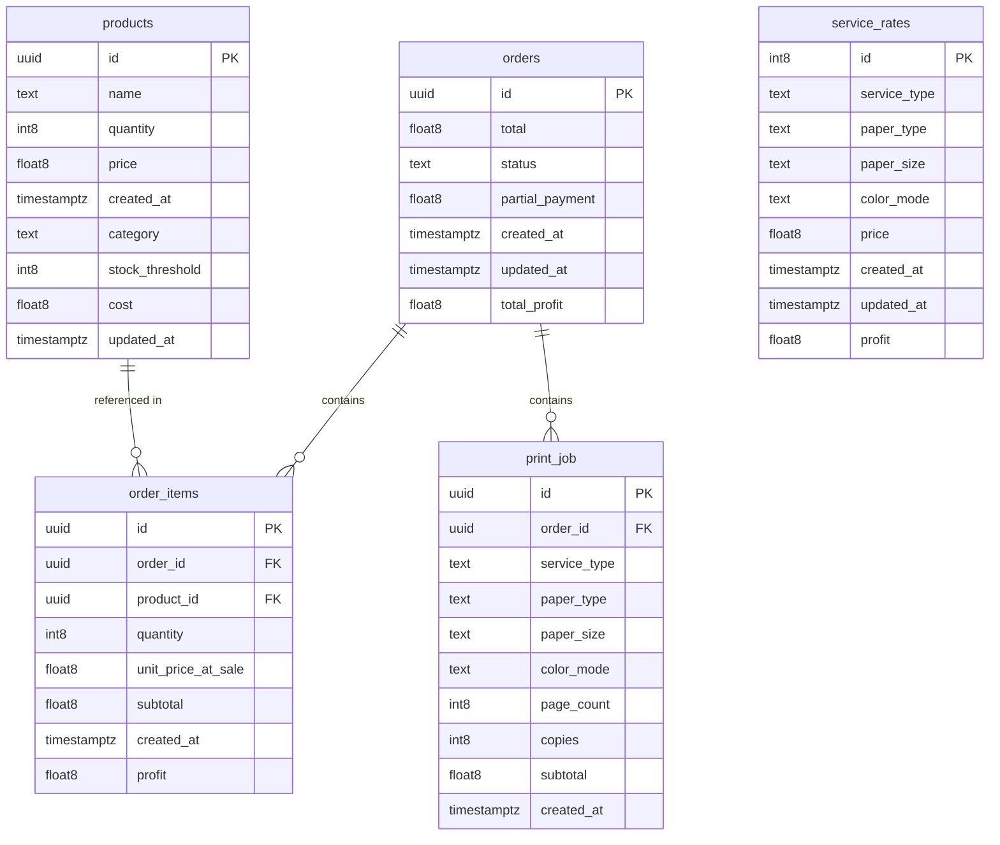

# AUJ Store — Database Architecture & Schema Documentation

**Database Engine:** PostgreSQL 17 (Supabase Managed)  
**Schema Version:** `20260912001600_remote_schema.sql`  
**Last Updated:** 2026-09-12  

---

## 1. Overview & Architecture

The AUJ Store database is designed to support a multi-purpose retail and printing shop. It manages inventory lifecycle, point-of-sale (POS) order processing, customized print/photocopy service jobs, sales historical records, and business analytics.

All operational tables reside in the `public` schema and enforce PostgreSQL **Row-Level Security (RLS)**.

---

## 2. Entity-Relationship Diagram



---

## 3. Schema Definitions

### 3.1 `orders`
Represents customer purchase transactions, checkout totals, payment statuses, and calculated profits.

| Column | Type | Nullable | Default | Description |
|:---|:---|:---|:---|:---|
| `id` | `uuid` | NO | `gen_random_uuid()` | Primary Key |
| `total` | `double precision` | NO | — | Total transaction amount |
| `status` | `text` | NO | — | Status (`complete`, `incomplete`) |
| `partial_payment` | `double precision` | YES | `NULL` | Partial amount paid for pending balances |
| `total_profit` | `double precision` | YES | `NULL` | Total profit aggregated from items/jobs |
| `created_at` | `timestamptz` | YES | `now()` | Timestamp of order creation |
| `updated_at` | `timestamptz` | YES | `now()` | Timestamp of last status/payment change |

* **Primary Key:** `orders_pkey` (`id`)
* **RLS:** Enabled

---

### 3.2 `order_items`
Line items associated with retail products purchased in an order.

| Column | Type | Nullable | Default | Description |
|:---|:---|:---|:---|:---|
| `id` | `uuid` | NO | `gen_random_uuid()` | Primary Key |
| `order_id` | `uuid` | YES | `gen_random_uuid()` | Foreign Key &rarr; `orders(id)` |
| `product_id` | `uuid` | YES | `gen_random_uuid()` | Foreign Key &rarr; `products(id)` |
| `quantity` | `bigint` | NO | — | Units purchased |
| `unit_price_at_sale` | `double precision` | YES | `NULL` | Price per unit at the time of sale |
| `subtotal` | `double precision` | YES | `NULL` | `quantity * unit_price_at_sale` |
| `profit` | `double precision` | YES | `NULL` | Calculated profit margin on this item |
| `created_at` | `timestamptz` | NO | `now()` | Record creation timestamp |

* **Primary Key:** `order_items_pkey` (`id`)
* **Foreign Keys:**
  * `order_items_order_id_fkey`: `order_id` &rarr; `orders(id)` (`ON UPDATE CASCADE ON DELETE CASCADE`)
  * `order_items_product_id_fkey`: `product_id` &rarr; `products(id)` (`ON UPDATE CASCADE ON DELETE RESTRICT`)
* **RLS:** Enabled

---

### 3.3 `products`
Inventory catalog of merchandise items sold in the store.

| Column | Type | Nullable | Default | Description |
|:---|:---|:---|:---|:---|
| `id` | `uuid` | NO | `gen_random_uuid()` | Primary Key |
| `name` | `text` | YES | `NULL` | Product display name |
| `quantity` | `bigint` | NO | — | Current units in stock |
| `price` | `double precision` | YES | `NULL` | Retail selling price |
| `cost` | `double precision` | YES | `NULL` | Acquisition cost (for profit computation) |
| `category` | `text` | YES | `NULL` | Category classification |
| `stock_threshold` | `bigint` | NO | — | Low-stock alert trigger threshold |
| `created_at` | `timestamptz` | NO | `now()` | Timestamp created |
| `updated_at` | `timestamptz` | YES | `now()` | Timestamp last modified |

* **Primary Key:** `products_pkey` (`id`)
* **RLS:** Enabled

---

### 3.4 `print_job`
Customized print and photocopy jobs associated with orders.

| Column | Type | Nullable | Default | Description |
|:---|:---|:---|:---|:---|
| `id` | `uuid` | NO | `gen_random_uuid()` | Primary Key |
| `order_id` | `uuid` | YES | `gen_random_uuid()` | Foreign Key &rarr; `orders(id)` |
| `service_type` | `text` | YES | `NULL` | `photocopy` or `print` |
| `paper_type` | `text` | YES | `NULL` | `copier` or `photo` |
| `paper_size` | `text` | YES | `NULL` | `short`, `a4`, `long`, `2r`, `3r`, `4r`, `5r` |
| `color_mode` | `text` | YES | `NULL` | `b&w` or `color` |
| `page_count` | `bigint` | YES | `NULL` | Number of document pages |
| `copies` | `bigint` | YES | `NULL` | Number of copies |
| `subtotal` | `double precision` | YES | `NULL` | Total computed cost for this job |
| `created_at` | `timestamptz` | NO | `now()` | Timestamp created |

* **Primary Key:** `print_job_pkey` (`id`)
* **Foreign Key:**
  * `print_job_order_id_fkey`: `order_id` &rarr; `orders(id)` (`ON UPDATE CASCADE ON DELETE CASCADE`)
* **RLS:** Enabled

---

### 3.5 `service_rates`
Pricing matrix configuration for printing and photocopying services.

| Column | Type | Nullable | Default | Description |
|:---|:---|:---|:---|:---|
| `id` | `bigint` | NO | `IDENTITY` (`print_rates_id_seq`) | Primary Key (Auto-increment) |
| `service_type` | `text` | YES | `NULL` | Service category |
| `paper_type` | `text` | YES | `NULL` | Paper stock type |
| `paper_size` | `text` | YES | `NULL` | Paper dimensions |
| `color_mode` | `text` | YES | `NULL` | `b&w` or `color` |
| `price` | `double precision` | YES | `NULL` | Configured customer price |
| `profit` | `double precision` | YES | `NULL` | Estimated profit per unit |
| `created_at` | `timestamptz` | YES | `now()` | Timestamp created |
| `updated_at` | `timestamptz` | YES | `now()` | Timestamp updated |

* **Primary Key:** `print_rates_pkey` (`id`)
* **Unique Constraint:** `print_rates_id_key` (`id`)
* **RLS:** Enabled

---

## 4. Views

### `unique_categories`
Provides distinct categories across current inventory items:
```sql
CREATE VIEW "public"."unique_categories" WITH (security_invoker=on) AS
  SELECT DISTINCT category
  FROM public.products;
```

---

## 5. Security & Row-Level Security (RLS) Policies

All tables have RLS enabled. Current policies:

| Table | Policy Name | Command | Target Role | Expression |
|:---|:---|:---|:---|:---|
| `orders` | `Enable read access for all authenticated users` | `SELECT` | `authenticated` | `USING (true)` |
| `orders` | `Enable insert for authenticated users only` | `INSERT` | `authenticated` | `WITH CHECK (true)` |
| `orders` | `Enable delete for authenticated users` | `DELETE` | `authenticated` | `USING (true)` |
| `order_items` | `Enable read access to all authenticated users` | `SELECT` | `authenticated` | `USING (true)` |
| `order_items` | `Enable insert for authenticated users only` | `INSERT` | `authenticated` | `WITH CHECK (true)` |
| `order_items` | `Enable delete for all authenticated users` | `DELETE` | `authenticated` | `USING (true)` |
| `print_job` | `Enable read access for all authenticated users` | `SELECT` | `authenticated` | `USING (true)` |
| `print_job` | `Enable insert for authenticated users only` | `INSERT` | `authenticated` | `WITH CHECK (true)` |
| `print_job` | `Enable delete for authenticated users` | `DELETE` | `authenticated` | `USING (true)` |
| `products` | `Enable read access for all authenticated users` | `SELECT` | `authenticated` | `USING (true)` |
| `products` | `Enable insert for admin users only` | `INSERT` | `authenticated` | `WITH CHECK (true)` |
| `products` | `Allow authenticated user to update table` | `UPDATE` | `authenticated` | `USING (true)` |
| `products` | `Enable delete for authenticated` | `DELETE` | `authenticated` | `USING (true)` |
| `service_rates` | `Enable read access for all authenticated users` | `SELECT` | `authenticated` | `USING (true)` |
| `service_rates` | `Enable insert for authenticated users only` | `INSERT` | `authenticated` | `WITH CHECK (true)` |
| `service_rates` | `Enable update for authenticated users only` | `UPDATE` | `authenticated` | `USING (true)` |
| `service_rates` | `Enable delete for authenticated users only` | `DELETE` | `authenticated` | `USING (true)` |

---

## 6. Code-First Migration Workflow

As of the baseline migration, schema changes are strictly version-controlled via SQL files in `supabase/migrations/`:

* **Baseline Migration:** `supabase/migrations/20260912001600_remote_schema.sql`
* **Local Diffing:** `npm run supabase:diff`
* **New Migration Creation:** `npm run supabase:migration:new <change_name>`
* **Migration Deployment:** `npm run supabase:push`

---

## 7. TypeScript Type Generation

Full database definitions are auto-generated directly from the live schema into [`lib/database.types.ts`](file:///c:/projects/webdevshiz/auj-store/lib/database.types.ts):

```bash
npm run supabase:types
```

This generates typed `Database['public']['Tables']` definitions for `orders`, `order_items`, `products`, `print_job`, `service_rates`, and view `unique_categories`.

---

## 8. Related References

* [Baseline Schema Diff & Notes](file:///c:/projects/webdevshiz/auj-store/docs/other/schema-diff.md)
* [Phase 8 Schema Follow-Up Tasks](file:///c:/projects/webdevshiz/auj-store/docs/other/follow-up-schema-cleanups.md)
* [Software Requirements Specification](file:///c:/projects/webdevshiz/auj-store/docs/srs.md)

