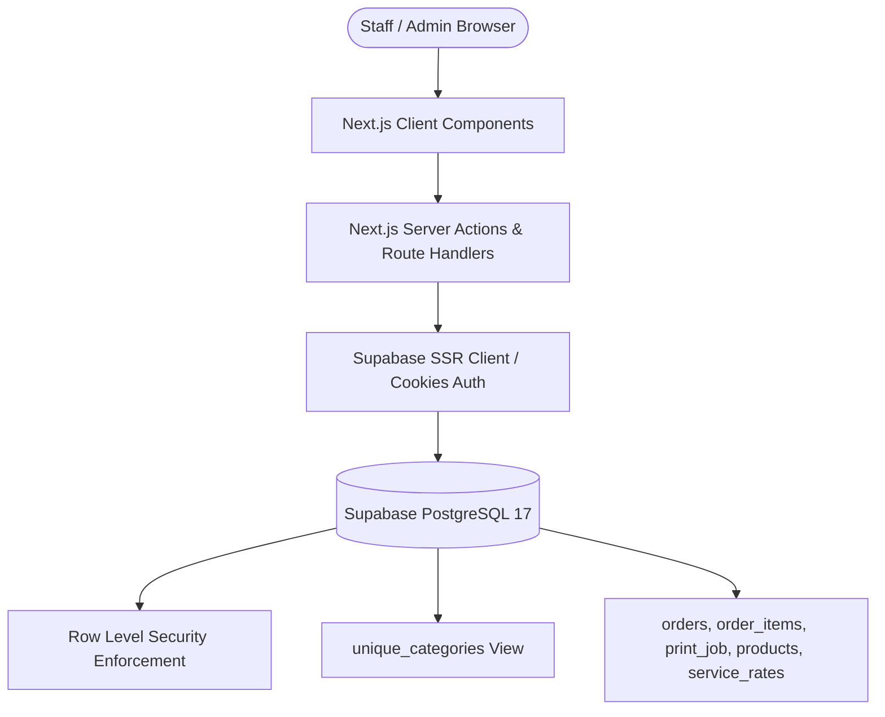
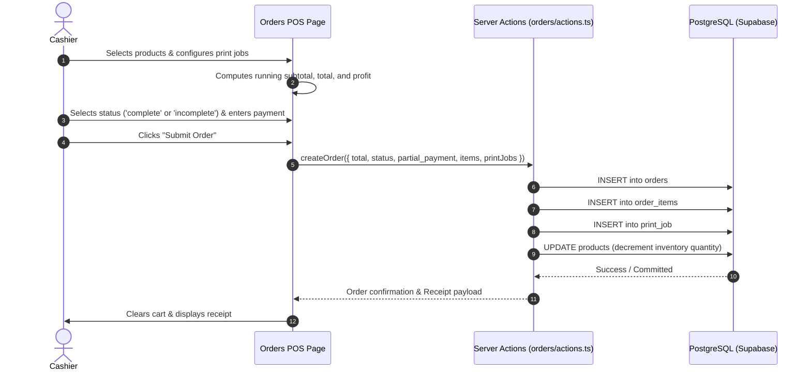

# AUJ Store — System & UI/UX Design Specification

**Specification Version:** 1.0.0  
**Target Platform:** Next.js 15+ (App Router) + Supabase  
**Design System:** Tailwind CSS + Radix UI / shadcn/ui  
**Last Updated:** 2026-09-12  

---

## 1. System Architecture

AUJ Store utilizes a modern full-stack serverless architecture powered by Next.js App Router and Supabase:



---

## 2. Directory & Route Hierarchy

```
app/
├── (public)
│   ├── auth/
│   │   ├── login/          # Staff / Admin Authentication
│   │   └── callback/       # OAuth / Auth confirmation handlers
│   └── page.tsx            # Landing / Login redirect
└── protected/
    ├── layout.tsx          # Authenticated App Shell (Sidebar, Header, User Menu)
    └── main/
        ├── dashboard/      # Financial KPIs, Sales overview, Low-stock alerts
        ├── orders/         # Point-of-Sale (POS) order processing & cart
        ├── inventory/      # Inventory CRUD, stock adjustment, categories
        ├── print-job/      # Print & photocopy rate calculator & job creation
        ├── history/        # Transaction search, receipt detail, order status
        └── analytics/      # Business performance charts & profit analysis
```

---

## 3. UI/UX Design System & Tokens

### 3.1 Color Palette & Typography
* **Primary System:** Tailwind CSS HSL color variables with light/dark theme support (`globals.css`).
* **Accent Colors:** Modern Emerald/Teal accents for POS actions, Rose for low-stock warnings and debts, Slate/Zinc neutral bases for high readability on POS screens.
* **Typography:** Clean sans-serif hierarchy (Inter / Geist) with high contrast for fast transaction processing.

### 3.2 Key Layout Components
1. **Sidebar Navigation:** Collapsible desktop sidebar providing direct access to Dashboard, POS, Inventory, Print Services, History, and Analytics.
2. **Top Navigation Bar:** Contextual page title, active notifications (e.g. low stock counters), and user profile / logout dropdown.
3. **Responsive Grid & Panels:**
   * **POS Terminal:** Dual-pane layout — Product & Print Job selection grid on the left (60-70% width), real-time Cart & Checkout calculation summary on the right (30-40% width).
   * **Data Tables:** Sortable, filterable tables for Inventory and Sales History with responsive action menus.

---

## 4. Component Architecture & Data Flow

### 4.1 POS & Order Processing Flow


### 4.2 Data Models & TypeScript Contracts
Core TypeScript interfaces in `lib/models.ts` strictly map to the PostgreSQL schema:
* `Product`: Maps to `products` table (including `stock_threshold`, `cost`, `price`).
* `Order`: Maps to `orders` table (fields: `id`, `total`, `status`, `partial_payment`, `total_profit`).
* `OrderItem`: Maps to `order_items` table.
* `PrintJob`: Maps to singular table `print_job` (fields: `service_type`, `paper_type`, `paper_size`, `color_mode`, `page_count`, `copies`, `subtotal`).

---

## 5. Security & Validation Specification

1. **Server-Side Validation:** All order amounts, product quantities, and print calculations are validated server-side in Server Actions before persistence.
2. **Foreign Key Integrity:** Cascading deletes protect order integrity while `ON DELETE RESTRICT` on `products` prevents accidental removal of sold items.
3. **Session Verification:** Every route under `/protected` validates user session cookie via Supabase SSR client in `layout.tsx` / `proxy.ts`.
